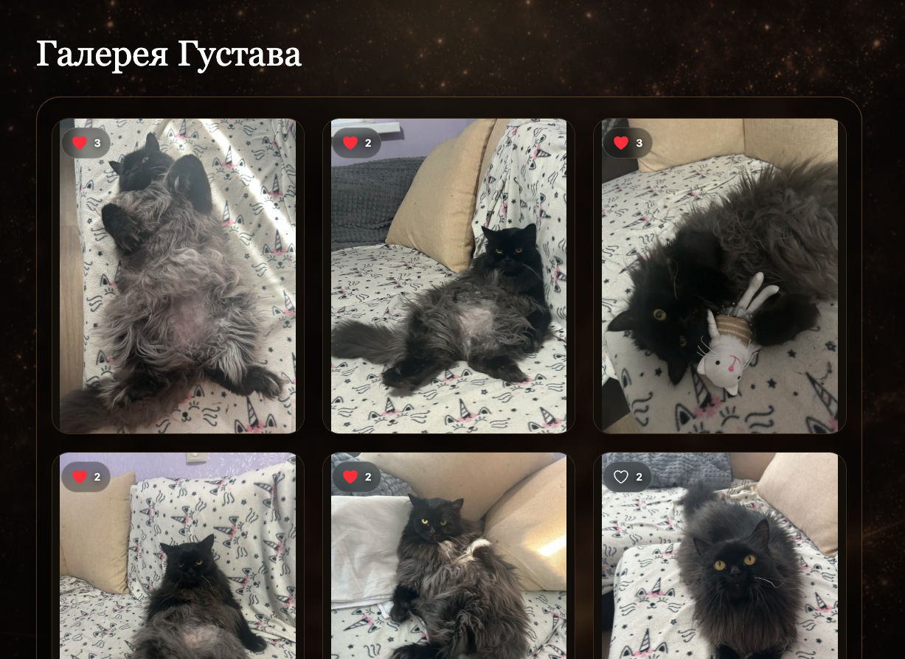
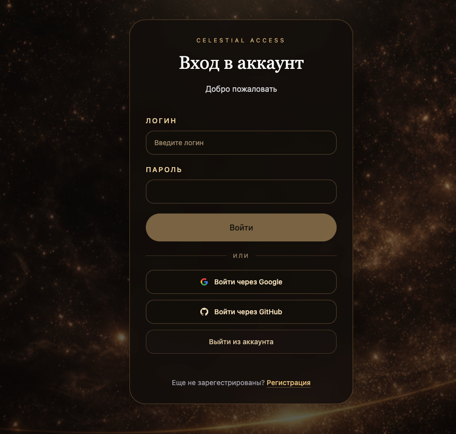

# Gustaw Photo Gallery

Современная fullstack фотогалерея на Next.js с системой лайков, аутентификацией и оптимизированной производительностью.

## 🚀 Demo
👉 http://gustaw.ru/

---

## 🖼 Interface

### ✨ Hero
[](./docs/hero.png)

---

### 🐾 Gallery
[](./docs/gallery.png)

---

### 🔐 Login
[](./docs/login.png)

---

### 👑 Audience
[](./docs/audience.png)

---

## 🔥 Key Features

- Authentication and authorization
- Photo gallery with infinite scroll
- Likes with optimistic UI updates
- Cloudinary-based image delivery
- Mobile-friendly responsive UI
- Performance-oriented frontend architecture
- Feature-Sliced Design (FSD)

---

## 🧠 Why this project matters

This project demonstrates more than basic CRUD:

- fullstack architecture on Next.js
- real user flows (auth, likes, gallery)
- client-server interaction with React Query
- optimized gallery loading
- production-style UI and UX

---

## 🛠 Tech Stack

- **Frontend**: Next.js 15, React 19, TypeScript  
- **Styling**: Tailwind CSS, Radix UI  
- **Backend**: Next.js API Routes, Prisma  
- **Database**: PostgreSQL  
- **State**: Zustand, React Query  
- **Storage**: Cloudinary  
- **Auth**: Custom JWT-based  

---

<details>
<summary>📚 Full technical description</summary>

## Overview

Gustaw is a modern fullstack photo gallery application built with Next.js.

The project focuses on:

- responsive UI  
- authentication  
- likes with optimistic updates  
- image delivery through Cloudinary  
- infinite scrolling gallery  
- performance-oriented frontend structure  

---

## Main Features

- photo upload and display  
- authentication and authorization  
- like system with optimistic updates  
- infinite scrolling gallery  
- responsive UI  
- mobile-friendly layout  

---

## Architecture

The project uses Feature-Sliced Design:

```text
src/
├── app/         # Next.js App Router
├── entities/    # Business entities
├── features/    # Feature modules
├── shared/      # Shared UI and utilities
└── kernel/      # Core types and config
